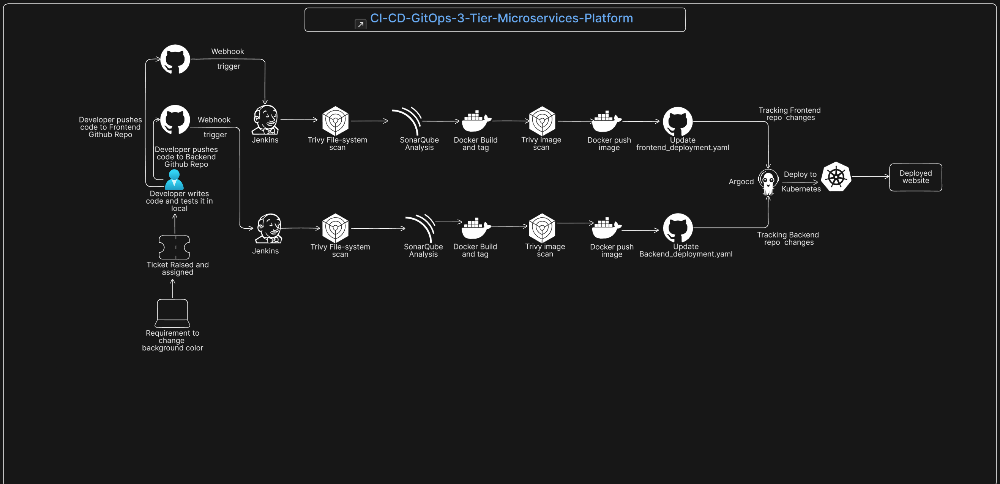

# CI-CD-GitOps-3-Tier-Microservices-Platform

  

# Project Overview

This project demonstrates the deployment of a containerized 3-tier application on Kubernetes using a complete DevOps workflow. The implementation includes Docker for containerization, Docker Compose for local testing, Jenkins for CI, Argo CD for CD, Kubernetes manifests for deployment, and AWS EKS provisioned using eksctl. The primary focus was to build hands-on experience in containerization, CI/CD, and Kubernetes deployment.

The application follows a 3-tier architecture consisting of:

- Frontend – React-based user interface
- Backend – Node.js/Express API service
- Database – MongoDB for data storage

# Detailed Explanation

## Purpose of the Project

The main objective of this project was to implement the concepts I learned as a beginner DevOps engineer into a practical real-world deployment scenario. Instead of running the application manually, I designed a workflow where the application can be:

- containerized efficiently,
- tested and run locally,
- deployed to a Kubernetes cluster,
- integrated with CI/CD tools,
- and managed in a cloud-native environment.

This project helped me understand how application development and DevOps practices work together in a real deployment lifecycle.

## Application Architecture

This is a 3-tier MERN application deployed as a microservices-style setup, where each major component is handled separately.

### 1. Frontend

The frontend is built with React and serves as the user-facing layer of the application. It communicates with the backend APIs for all business operations and data interactions.

### 2. Backend

The backend is built with Node.js and Express. It exposes APIs that handle the application logic and communicate with MongoDB to store and retrieve data.

### 3. Database

The database layer uses MongoDB.

## Containerization Approach

To containerize the application, I created separate multi-stage Dockerfiles for the frontend and backend services.

### Why multi-stage Dockerfiles?

Multi-stage builds helped reduce the final Docker image size by separating the build environment from the runtime environment. This made the images lighter, cleaner, and better suited for deployment.

### Database container

For MongoDB, I used the official MongoDB Docker image instead of creating a custom image, which is a common and reliable practice.

To simplify database visibility and management during development, I also used the official Mongo Express image. Mongo Express provided a web-based interface to view and interact with the MongoDB database, which made it easier to inspect collections and verify stored data.

### Local development

Before deploying to Kubernetes, I created a Docker Compose setup so the full application could be run locally. This allowed me to validate communication between frontend, backend, and database in a controlled local environment before moving to cloud deployment.

## Kubernetes Deployment

After validating the application locally, I deployed it to Amazon EKS.

### EKS Cluster Creation

I created the Kubernetes cluster on AWS using eksctl, which simplified the provisioning of the EKS control plane and worker nodes.

### Kubernetes Resources Used

To deploy the application components, I prepared Kubernetes manifests for each service:

- deployment.yaml for frontend and backend
- service.yaml for frontend and backend

## Traffic Routing and API Gateway

To expose and route traffic to the application, I used Envoy Gateway / Kubernetes Gateway API resources.

The routing layer included:

- gatewayclass.yaml
- gateway.yaml
- httproute.yaml

This setup allowed controlled routing of external traffic to the correct application services inside the cluster. It also helped me understand how modern Kubernetes traffic management works beyond traditional ingress-based setups.

## CI/CD Implementation

A major part of this project was building the CI/CD pipeline for automated deployment.

I used Jenkins to implement the Continuous Integration pipeline. The Jenkins pipeline was responsible for automating the build process of the application and integrating DevOps workflow practices.

Typical CI responsibilities in this project included:

### 1. Fetch source code from the respective GitHub repository

The pipeline starts by pulling the latest application code from the corresponding GitHub repository.

### 2. Run Trivy file system scan

A Trivy file system scan is performed on the source code to identify potential vulnerabilities and security issues before the image build process begins.

### 3. Perform SonarQube analysis

SonarQube is used to analyze the codebase for code quality, bugs, code smells, and maintainability issues.

### 4. Build and tag Docker images

Docker images are built for the frontend and backend services and tagged appropriately for versioning and deployment.

### 5. Run Trivy image scan

After the images are built, Trivy is used again to scan the Docker images for known vulnerabilities at the container image level.

### 6. Push images to Docker Hub

The validated images are pushed to their respective frontend and backend Docker Hub repositories.

### 7. Update image reference in Kubernetes deployment manifests

The pipeline updates the deployment.yaml file with the newly built image tag so that the latest version can be deployed through the CD workflow.

## CD with Argo CD

For Continuous Deployment, I used Argo CD, following the GitOps approach. Argo CD continuously monitored the Kubernetes manifests stored in Git and synchronized the changes to the EKS cluster. This helped me understand declarative deployments and how Git can act as the source of truth for Kubernetes applications.

# Project Scope

The primary focus of this project was to containerize a 3-tier MERN application and implement a CI/CD workflow for deployment on an Amazon EKS cluster. The goal was to gain hands-on experience with core DevOps concepts such as Docker, Docker Compose, Jenkins, Argo CD, Kubernetes manifests, and EKS cluster deployment using eksctl.

This project was built as a learning-focused implementation to understand the end-to-end workflow of packaging, deploying, and managing a containerized application in Kubernetes.

# Current Project Focus

This project mainly covers:

1. Containerization of frontend and backend using multi-stage Dockerfiles
2. Local application execution using Docker Compose
3. Kubernetes-based deployment of the 3-tier application
4. EKS cluster provisioning using eksctl
5. CI implementation using Jenkins
6. CD implementation using Argo CD
7. Traffic routing using Gateway API / Envoy configuration

# Future Enhancements

While this project successfully demonstrates the core deployment workflow, several production-oriented enhancements were intentionally kept out of scope so the main focus could remain on containerization and CI/CD implementation.

Possible improvements for this project include:

1. Infrastructure as Code using Terraform instead of manual or eksctl-based cluster provisioning
2. More secure infrastructure design based on the Principle of Least Privilege
3. Persistent storage using AWS EBS volumes for stateful workloads such as MongoDB
4. StatefulSet-based database deployment for better storage stability and workload management
5. Horizontal Pod Autoscaler (HPA) for scaling application pods based on resource usage
6. Cluster Node Autoscaler for automatically adjusting worker nodes based on workload demand
7. Canary deployment strategy for safer and gradual application releases

These enhancements are implemented more deeply in my advanced project: **[Enterprise GitOps Platform: Automated EKS Infrastructure and 3-Tier Microservices](https://github.com/shashankc20mca/Enterprise-GitOps-Platform-Automated-EKS-Infrastructure-and-3-Tier-Microservices)**, where the focus shifts from basic deployment to more production-oriented infrastructure automation, security, scalability, and release management.
